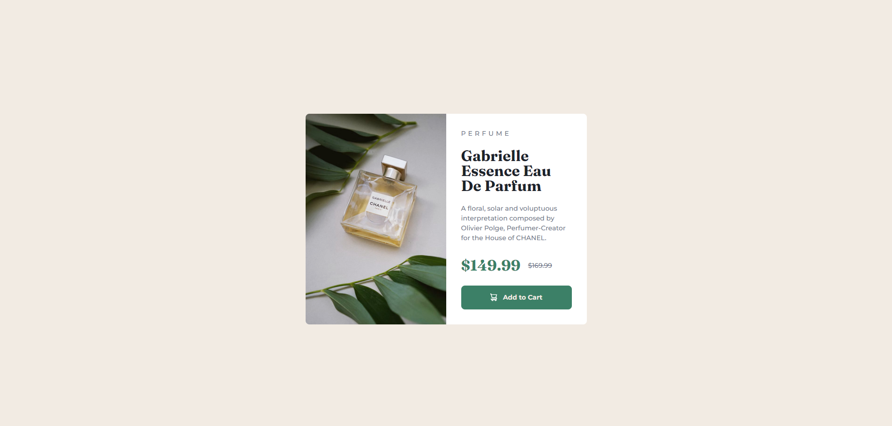

# Frontend Mentor - Product preview card component solution

This is a solution to the [Product preview card component challenge on Frontend Mentor](https://www.frontendmentor.io/challenges/product-preview-card-component-GO7UmttRfa).

## Table of contents

- [Overview](#overview)
  - [The challenge](#the-challenge)
  - [Screenshot](#screenshot)
  - [Links](#links)
- [My process](#my-process)
  - [What I learned](#what-i-learned)
  - [Useful resources](#useful-resources)
- [Author](#author)

## Overview

### The challenge

Users should be able to:

- View the optimal layout depending on their device's screen size
- See hover and focus states for interactive elements

### Screenshot



### Links

- Live Site URL: <a href="https://frontend-mentor-product-preview-9fd5d.web.app/" target="_blank">Click Here</a>

## My process

### What I learned

I learned how to handle multiple media elements when handling with different screen size by using `<source>` tag and giving it media size of when to change to the image on the screen. Another, thing I learned was CSS Pseudo-Element and Data-Attributes to add contents before/after elements, this helped me create add to cart button by adding the cart image before the text.

```html
<picture class="product-image">
	<source
		srcset="./images/image-product-mobile.jpg"
		media="(max-width: 600px)"
	/>
	
</picture>

<button class="product-cart" data-icon="cart">Add to Cart</button>
```

```css
.product-cart {
	text-decoration: none;
	cursor: pointer;
	display: inline-flex;
	gap: 0.75rem;
	justify-content: center;
	align-items: center;

	border: none;
	border-radius: 0.5rem;
	background-color: var(--clr-price-cart);
	color: var(--clr-bg);
	font-weight: 700;

	padding: 0.75rem 1.5rem;
}

.product-cart[data-icon='cart']::before {
	content: '';
	background-image: url(/images/icon-cart.svg);
	width: 15px;
	height: 16px;
}
```

### Useful resources

- <a href="https://css-tricks.com/snippets/css/a-guide-to-flexbox/" target="_blank">Flexbox</a> - This helped me understand and how to use flex.
- <a href="https://developer.mozilla.org/en-US/docs/Web/HTML" target="_blank">Learning HTML</a> - This website helped me understand different tags and elemetns in HTML.
- <a href="https://developer.mozilla.org/en-US/docs/Web/CSS" target="_blank">Learning CSS</a> - This website helped me understand different properties and values in CSS.
- <a href="https://css-tricks.com/snippets/css/complete-guide-grid/" target="_blank">Grid</a> - This helped me understand and how to use grid.
- <a href="https://developer.mozilla.org/en-US/docs/Web/CSS/CSS_media_queries/Using_media_queries" target="_blank">Learning Media Queries</a> - This website helped me understand how to use media queries in CSS.
- <a href="https://www.w3schools.com/tags/tag_source.asp" target="_blank">Handle Media Elements</a> - This website helped me understand how to use source tag in HTML and CSS on how to handle multiple media elements.
- <a href="https://www.w3schools.com/tags/tag_source.asp" target="_blank">CSS Pseudo-Element, Data-Attributes</a> - This website helped me understand how to use CSS pseudo-element with data-attributes to add content after/before element.

## Author

- Linkedin - [Jaweed Inayathulla](https://www.linkedin.com/in/jaweedinayathulla/)
- Frontend Mentor - [@InaJaweed](https://www.frontendmentor.io/profile/InaJaweed)
